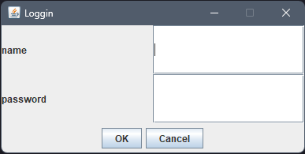
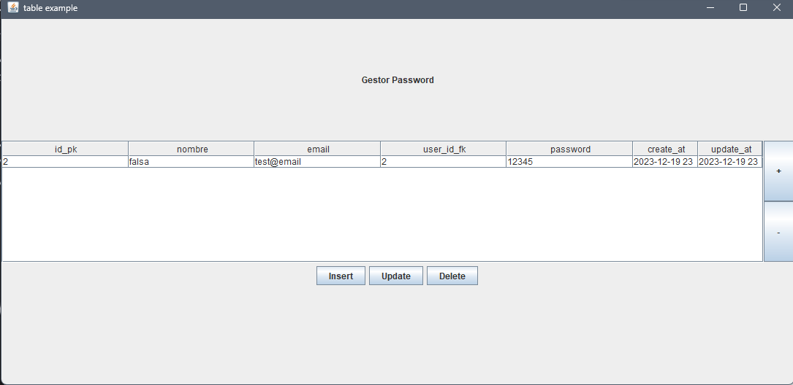
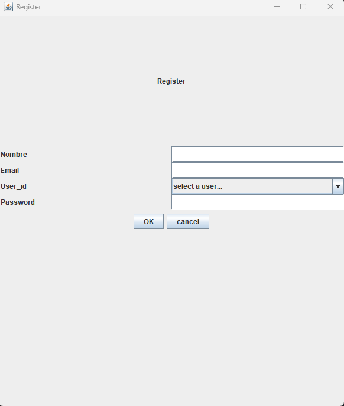
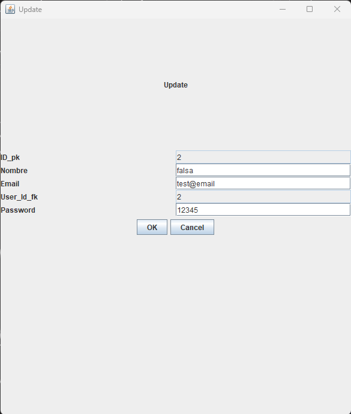

# Gestor Password
>- simple GUI App for password management.
>- created using MYSQL, JAVA SWING and AWT.



------



------



------

## Dependencies
>- [java-mysql-orm](https://github.com/AlfonsoG-dev/java-mysql-eje)
>- [java-build-tool](https://github.com/AlfonsoG-dev/javaBuild)
>- [mysql JDBC](https://dev.mysql.com/downloads/connector/j/5.1.html)
>- [java-jdk-17](https://www.oracle.com/java/technologies/javase/jdk17-archive-downloads.html)
>- [java_swing](https://www.tutorialspoint.com/swingexamples/index.htm)

## Features

- [x] loggin 
- [x] list, add, delete and update passwords
- [x] allow insert cuenta directly from table

## Usage

>- Create the database and tables.
>>- using the [java-mysql-orm](https://github.com/AlfonsoG-dev/java-mysql-eje)

```java

// create the DbConfig instance with the correspondent data
new DbConfig(dataBase, host, port, user, password);

// Create the DAO instance for each of the tables
// user table
new MigrationDAO("user", new DbConfig("", "", "", "", ""));

// cuenta table
new MigrationDAO("cuenta", new DbConfig("", "", "", "", ""));

```

>- insert manually the user for login purposes

```java
User admin = new User(Nombre, Email, Password, Rol);
admin.setCreate_at();
String condition = "nombre: " + admin.getNombre() + ", password: " + admin.getPassword();
new QueryDAO<User>("user", DbConfig).InsertNewRegister(admin, condition, "and", new UserBuilder());
```

## TODO'S
- [ ] create usage instructions

## Disclaimer
>- this proyect is for educational purposes
>- securitty issues are not taken into account
