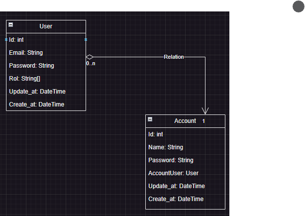

# Password Manager Documentation
- this is a manager for password that can be use with CLI and GUI 
- the manager can create, delete and update the account of the loged user

# Clases or Objects
- User.
- Account.

## User
- have an email
>- the email is for login purposes
>- the email is protected with a password with the same purpose

- have a rol
>- the rol determines the list of permissions of the loged user
>- the list of permissions are set in the account creation for the user

- have update and create date
>- the date is for tracking the update and creation date of the user

## Account
- have a name
>- the name determines the alias for the creted account
>- the name has to bee unique

- have an email
>- is the email for the password that needs to be created in the manager

- hava a relation with user
>- the user is the owner of the account
>- a user can have many account, the account can have only one user

- have update and create date
>- the date is for tracking the update and creation date of the account

### Realtion Diagram
[diagram](./gestor_password_relation_diagram.drawio)

